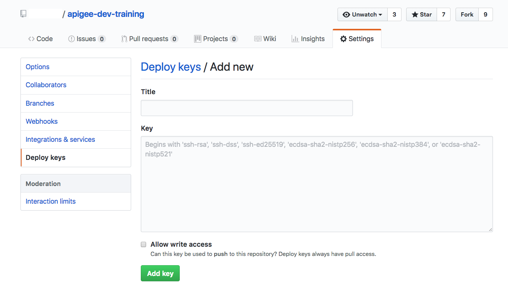

# Apigee CI/CD Demo 

CI/CD demo for building, deploying and testing API proxies

# Setting up Jenkins

1. Clone this repository;

        $ git clone git@github.com:apichick/apigee-ci-cd-demo.git

2. Change to the apigee-ci-cd-demo directory.

        $ cd apigee-ci-cd-demo

3. Create a folder called secrets inside the apigee-ci-cd-demo folder.

        $ mkdir secrets

4. Generate an SSH key pair. Please do not set any passphrase.

        $ ssh-keygen -t rsa -b 4096 -C "your_email@example.com"

5. Create the file below containing your Apigee credentials 

        $ echo "USERNAME=YOUR-APIGEE-USERNAME\nPASSWORD=YOUR-APIGEE-PASSWORD" > secrets/apigee-credentials

6. Copy the private to secrets folder with the following command:

        $ cp PRIVATE-KEY-FILE-PATH secrets/git-private-key

7. Replace APIGEE_ORGANIZATION with the name of your organization in config-files/apigee-settings.xml

        $ sed -i .bak "s/APIGEE-ORGANIZATION/YOUR-APIGEE-ORGANIZATION/g" config-files/apigee-settings.xml

8. Run the following command:

        $ docker-compose up

9. Load the jenkins home page (http://localhost:8080) in your browser and double-check that everything works properly.

# Configuring the job

NOTE: We will assume that we have one organization with two environments: test and prod.

1. Create a fork for the following repository in Github:

        git@github.com:apichick/book-api-v1.git

2. Add the public key corresponding to the private key used in step 4 of the previous section as a deploy key to your fork.

3. Clone the fork.

5. Create a branch for the prod environment and push it to the remote.

        $ git checkout -b prod
        $ git push origin prod

9. In Jenkins click on the job named job-template and then trigger a build supplying as job name the value book-api-v1, as repository URL the one of your fork and the branches to include separated by spaces, in this case: feature/* master prod. The job-template job is a seed job used to create a multibranch pipeline for the API proxies that we would like to build.

10. Every time a branch is created or updated in the remote a build of the job created in the previous step will be triggered.
